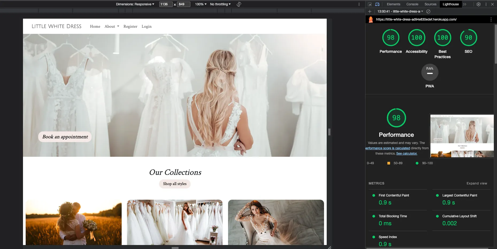

# Little White Dress

Little White Dress (LWD) is a website developed as part of a Portfolio Project for my Full Stack Software Development course delivered by Code Institute. The idea was born out of a real-world need; a close friend who is a wedding planner with a dream to open their own wedding dress store.

A visitor to the LWD website can easily browse the products on sale, make a booking to attend the store and try on dresses, and join a community of brides who share recommendations.

[Visit the  live website here]()

 

## Contents
----

### [User Experience (UX)](#user-experience-ux-1)
- [Purpose](#purpose)
- [User Stories](#user-stories)
  - [First Time Visitors](#first-time-visitor-goals)
  - [Returning Visitors](#returning-visitor-goals)
  - [Frequent Users](#frequent-visitor-goals)

### [Design](#design-1)
- [Colour Scheme](#colour-scheme)
- [Typography](#typography)
- [Imagery](#imagery)
- [Wireframes](#wireframes)

### [Database and Logic](#database-and-logic-1)
- [User Journey](#user-journey)
- [Epics](#epics)
- [Kanban Board](#kanban-board)
- [Database](#database)

### [Project Structure](#project-structure-1)
- [Apps](#apps)
  - [Product](#products)
  - [Customer](#customer)
  - [Contact](#contact)
  - [Recommendations](#recommendations)
  - [Appointment](#appointment)

### [Features](#features-1)
- [Existing Features](#existing-features)
  - [Homepage](#homepage)
  - [Next page](#next_page)
- [Accessibility](#accessibility)
- [Future Features](#future-features)

### [Technologies](#technologies-1)

### [Version Control](#version-control-1)

### [Deployment](#deployment-1)

### [Testing](#testing-1)
- [Function Testing](#function-testing)
- [User Story Testing](#user-story-testing)
- [Lighthouse](#lighthouse)
- [Validator Testing](#validator-testing)
- [Bugs](#bugs)

### [Credits](#credits-1)
- [Resources](#resources)
- [Acknowledgements](#acknowledgements)

 

----

 

## User Experience (UX)
### **Purpose**

As the Little White Dress website has been created for a business *idea*, the UX and UI have been developed closely with the prospective business owner's input throughout. A strong brand identity has been central to decisions around typography, imagery, and colours to create a feeling of sophisticated luxury but with a welcoming warmth.

The main purposes of the webpage is to provide visitors with the ability to view products for sale, book appointments, and join a community of other brides.

The site has been built with a mobile-first responsive design. The needs of the user and the brand identity have been kept at the forefront of the design process.

 

### User Stories
### **Client Goals**
- As site admin I want to be able to upload and remove any dress products from the site
- As a site admin I want to be able to view any enquiries sent via the website contact form
- As site admin I want to be able to view any bookings by customers to come and try on dresses
- As site admin I want to be able to amend any bookings by customers to come and try on dresses
- As site admin I want to be able to cancel any bookings by customers to come and try on dresses
- The website should create a strong brand identity
- The website should be responsive across different devices

 

### **First Time Visitor Goals** 
- As a first time user I want to browse available wedding dresses
- As a first time user I want to book an appointment to try on dresses
- As a first time user I want to save my favourite dresses so I can refer back to them later
- As a first time user I want to be able to contact the store
- As a first time user I want to be able to filter my search by dress style and price
- As a first time user I want to view details about the dress such as price and available sizes
- As a first time user I want to be able to find recommendations for other wedding services in the bridal community

 

### **Returning Visitor Goals**
- As a returning user I want to see my favourite dresses
- As a returning user I want to view any current bookings I have to try on dresses
- As a returning user I want to amend any current bookings I have to try on dresses
- As a returning user I want to cancel any current bookings I have to try on dresses
- As a returning user I want to be able to post recommendations for other wedding services to the bridal community

 

----

## Design
### **Colour Scheme**
The colour scheme for this site has been kept fairly simple with just a couple of really key shades. This is in keeping with the sophisticated and clean brand identity.

The main colour (F4E9E5) was selected as it reflects the soft feminine feel that relates to being 'bridal'.

The colour palette was created using the [Coolors](https://coolors.co/) website.

 

### **Typography**
All fonts were sourced from [Google Fonts](https://fonts.google.com/)
#### Logo
The font used for the logo is 'Julius Sans One'

#### Web Content
The font used for the body content throughout the site is called 'Crimson Text'

 

### **Imagery**
All images were sourced from [Adobe Stock](https://stock.adobe.com/uk/) and [iStock Photo](https://www.istockphoto.com/), with the exception of the owner image on the contact page. This image is a personal image belonging to Samantha Landy, who gave permission for it's use on this site.

Images have been specifically chosen to be in keeping with the brand identity. They are light, clean and professional.

The Favicon was also deisnged in this way and has been generated using the website colour #F4E9E5 and the logo font 'Julius Sans One'. It was created on [Favicon.io](https://favicon.io/).

 

### **Wireframes**
[Balsamiq Wireframing Software](https://balsamiq.com/) was used to create the wireframes.

Homepage

 

About

Contact

Products

Product Details

Profile

Appointments

 

For a full PDF of all wireframes (mobile, tablet, desktop) click [here](readme_assets/wireframes_all.pdf).

----

## Database and Logic

Careful consideration was taken in the planning stages of this project. Initial user journeys were mapped out for both the admin and general user. From these an ER Diagram was created.

### **User Journey**

 

  

### **Database**

 

### **Epics**

### **Kanban Board**
A Kanban approach was used to keep track of the flow of the project. Once User Stories were set up in the Project they were assigned to EPICs and began the project journey in the 'ToDo' column. As development progressed these moved through 'In Progress' to finally 'Done'. An additional column was added 'Unable to implement' for any features that were not successfully completed.

[You can visit the project board here](https://github.com/users/llewellynksj/projects/5/views/1)

Below is an example part way through the site build:

----

## Project Structure
### **Apps:**
Little White Dress has a total of 5 Apps. These are:
* Product
* Customer
* Contact
* Recommendations
* Appointment

These are outlined with their corresponding models below.

#### PRODUCT

  * Holds the database for any products displayed on the website
  * Displays the homepage and various product views
  * Adds liked products to customer record

Models:

 

#### CUSTOMER

  * Holds the database for all customer profiles
  * Displays the customer profile pages and all update pages related to the user
  * Holds the templates for all customer and user related pages including registration

Models:

 

#### CONTACT

  * Holds the database for the store's contact details and for any enquiries made via the contact form
  * Displays the contact page

Models:

 

#### RECOMMENDATIONS

  * Holds the database for all recommendations made in the brides community section of the website
  * Displays all recommendations including specific recommendations to logged in users
  * Enables CRUD functionality:
    - Create a Recommendation
    - Read all community Recommendations
    - Update and amend own Recommendations
    - Delete own Recommendations

Models:

 

#### APPOINTMENT

  * Holds the database for all appointments that are made
  * Displays the appointment booking and confirmation pages
  * Enables CRUD functionality:
    - Create an Appointment
    - Read/view all booked Appointments
    - Update and reschedule Appointments
    - Delete/cancel Appointments

Models:

----

## Features
### **Existing Features**

 

### **Accessibility**
In addition to being best practice, having an accessible website is extremely high on the list of requirements for the target audience. Close attention has been paid to the following in order to ensure the site is as accessible as possible:
- Clear and simple font styling, avoiding any cursive or calligraphic scripts.
- Contrasting colour scheme, but avoiding colours that are too bold.
- Use of semantic HTML
- Ensuring all images have an alt description for screen readers or where the image cannot be loaded. Also ensuring that these are as descriptive as possible.

 

### **Future Features**
In the future there are features and developments that it would be useful to consider adding to create an even better user experience of this website. They include:

- 

 

----

## Technologies
### **Languages Used**
This website has been written in .

 

**Frameworks, Libraries and Programs Used**
- 

 

----

## Version Control
Version control has been maintained using Git. The code written for this website has been updated via regular commits to Github. These serve as a record of development and changes made.

The commit history can be viewed [here]()

 

----

## Deployment

 

----

## Testing
Testing was performed across a range of devices, including:
- 

### **Function Testing**

| Page | Test | Successfully Completed |
| :----| :---| :----------------------:|
|  |  |  |
|  |  |  |
|  |  |  |
|  |  |  |
|  |  |  |
|  |  |  |
|  |  |  |

 

### **User Story Testing**

| Client Goal | Solution | Tested & Successfully Completed |
| :----| :---| :----------------------:|
|   |  |  |
|   |  |  |
|   |  |  |
|   |  |  |
|   |  |  |

 

| First Time Visitor Goal | Solution | Tested & Successfully Completed |
| :----| :---| :----------------------:|
|   |  |  |
|   |  |  |
|   |  |  |
|   |  |  |

 

| Returning Visitor Goal | Solution | Tested & Successfully Completed |
| :----| :---| :----------------------:|
|  |  |  |
|  |  |  |
|  |  |  |

 

| Frequent Visitor Goal | Solution | Tested & Successfully Completed |
| :----| :---| :----------------------:|
|  |  |  |
|  |  |  |
|  |  |  |

 

### **Lighthouse**

For Mobile Devices

Homepage

All Products

Category Products

Product Detail

About

Contact

Register

Login

Profile

Settings

Recommendations

Appointments

 

For Desktop

Homepage

All Products

Category Products

Product Detail

About

Contact

Register

Login

Profile

Settings

Recommendations

Appointments

 

### **Validator Testing**
HTML

Homepage

Dates Page

 

CSS

Stylesheet

   

### **Bugs**
  
  | Raised by | Bug | Solution |
  | :---      | :---| :---     |
  |  |  |  |
  |  |  |  |
  |  |  |  |
  |  |  |  |
  |  |  |  |
  |  |  |  |

 

----

## Credits
### **Resources**
- 

 

### **Acknowledgements**
