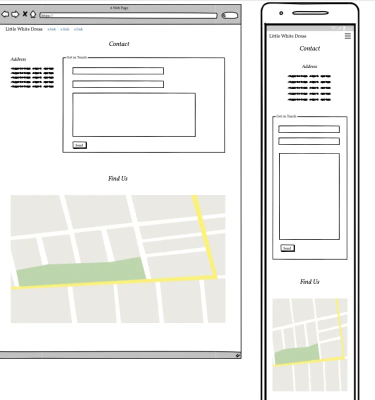

# Little White Dress

Little White Dress (LWD) is a website developed as part of a Portfolio Project for my Full Stack Software Development course delivered by Code Institute. The idea was born out of a real-world need; a close friend who is a wedding planner with a dream to open their own wedding dress store.

A visitor to the LWD website can easily browse the products on sale, make a booking to attend the store and try on dresses, and join a community of brides who share recommendations.

[Visit the  live website here](https://little-white-dress-ad94e830edef.herokuapp.com/)

 

## Contents
----

### [User Experience (UX)](#user-experience-ux-1)
- [Purpose](#purpose)
- [User Stories](#user-stories)
  - [First Time Visitors](#first-time-visitor-goals)
  - [Returning Visitors](#returning-visitor-goals)
  - [Frequent Users](#frequent-visitor-goals)

### [Design](#design-1)
- [Colour Scheme](#colour-scheme)
- [Typography](#typography)
- [Imagery](#imagery)
- [Wireframes](#wireframes)

### [Database and Logic](#database-and-logic-1)
- [User Journey](#user-journey)
- [Epics](#epics)
- [Kanban Board](#kanban-board)
- [Database](#database)

### [Project Structure](#project-structure-1)
- [Apps](#apps)
  - [Product](#products)
  - [Customer](#customer)
  - [Contact](#contact)
  - [Recommendations](#recommendations)
  - [Appointment](#appointment)

### [Features](#features-1)
- [Existing Features](#existing-features)
  - [Homepage](#homepage)
  - [Next page](#next_page)
- [Accessibility](#accessibility)
- [Future Features](#future-features)

### [Technologies](#technologies-1)

### [Version Control](#version-control-1)

### [Deployment](#deployment-1)

### [Testing](#testing-1)
- [Function Testing](#function-testing)
- [User Story Testing](#user-story-testing)
- [Lighthouse](#lighthouse)
- [Validator Testing](#validator-testing)
- [Bugs](#bugs)

### [Credits](#credits-1)
- [Resources](#resources)
- [Acknowledgements](#acknowledgements)

 

----

 

## User Experience (UX)
### **Purpose**

As the Little White Dress website has been created for a business *idea*, the UX and UI have been developed closely with the prospective business owner's input throughout. A strong brand identity has been central to decisions around typography, imagery, and colours to create a feeling of sophisticated luxury but with a welcoming warmth.

The main purposes of the webpage is to provide visitors with the ability to view products for sale, book appointments, and join a community of other brides.

The site has been built with a mobile-first responsive design. The needs of the user and the brand identity have been kept at the forefront of the design process.

 

### User Stories
### **Client Goals**
- As site admin I want to be able to upload and remove any dress products from the site
- As a site admin I want to be able to view any enquiries sent via the website contact form
- As site admin I want to be able to view any bookings by customers to come and try on dresses
- As site admin I want to be able to amend any bookings by customers to come and try on dresses
- As site admin I want to be able to cancel any bookings by customers to come and try on dresses
- The website should create a strong brand identity
- The website should be responsive across different devices

 

### **First Time Visitor Goals** 
- As a first time user I want to browse available wedding dresses
- As a first time user I want to book an appointment to try on dresses
- As a first time user I want to save my favourite dresses so I can refer back to them later
- As a first time user I want to be able to contact the store
- As a first time user I want to be able to filter my search by dress style and price
- As a first time user I want to view details about the dress such as price and available sizes
- As a first time user I want to be able to find recommendations for other wedding services in the bridal community

 

### **Returning Visitor Goals**
- As a returning user I want to see my favourite dresses
- As a returning user I want to view any current bookings I have to try on dresses
- As a returning user I want to amend any current bookings I have to try on dresses
- As a returning user I want to cancel any current bookings I have to try on dresses
- As a returning user I want to be able to post recommendations for other wedding services to the bridal community

 

----

## Design
### **Colour Scheme**
The colour scheme for this site has been kept fairly simple with just a couple of really key shades. This is in keeping with the sophisticated and clean brand identity.

The main colour (F4E9E5) was selected as it reflects the soft feminine feel that relates to being 'bridal'.

The colour palette was created using the [Coolors](https://coolors.co/) website.

 

### **Typography**
All fonts were sourced from [Google Fonts](https://fonts.google.com/)
#### Logo
The font used for the logo is 'Julius Sans One'

#### Web Content
The font used for the body content throughout the site is called 'Crimson Text'

 

### **Imagery**
All images were sourced from [Adobe Stock](https://stock.adobe.com/uk/) and [iStock Photo](https://www.istockphoto.com/), with the exception of the owner image on the contact page. This image is a personal image belonging to Samantha Landy, who gave permission for it's use on this site.

Images have been specifically chosen to be in keeping with the brand identity. They are light, clean and professional.

The Favicon was also deisnged in this way and has been generated using the website colour #F4E9E5 and the logo font 'Julius Sans One'. It was created on [Favicon.io](https://favicon.io/).

 

### **Wireframes**
[Balsamiq Wireframing Software](https://balsamiq.com/) was used to create the wireframes.

Homepage

 

About

Contact

Products

Product Details

Profile

Appointments

 

For a full PDF of all wireframes (mobile, tablet, desktop) click [here](readme_assets/wireframes_all.pdf).

----

## Database and Logic

Careful consideration was taken in the planning stages of this project. Initial user journeys were mapped out for both the admin and general user. From these an ER Diagram was created.

### **User Journey**

 

  

### **Database**

 

### **Epics**

### **Kanban Board**
A Kanban approach was used to keep track of the flow of the project. Once User Stories were set up in the Project they were assigned to EPICs and began the project journey in the 'ToDo' column. As development progressed these moved through 'In Progress' to finally 'Done'. An additional column was added 'Unable to implement' for any features that were not successfully completed.

[You can visit the project board here](https://github.com/users/llewellynksj/projects/5/views/1)

Below is an example part way through the site build:

----

## Project Structure
### **Apps:**
Little White Dress has a total of 5 Apps. These are:
* Product
* Customer
* Contact
* Recommendations
* Appointment

These are outlined with their corresponding models below.

#### PRODUCT

  * Holds the database for any products displayed on the website
  * Displays the homepage and various product views
  * Adds liked products to customer record

Models:

 

#### CUSTOMER

  * Holds the database for all customer profiles
  * Displays the customer profile pages and all update pages related to the user
  * Holds the templates for all customer and user related pages including registration

Models:

_Additional fields were added to the Customer model in the later stages of development to give a fuller sense of a profile. These included 'partners_name', 'wedding_location', and 'wedding_theme'._

 

#### CONTACT

  * Holds the database for the store's contact details and for any enquiries made via the contact form
  * Displays the contact page

Models:

 

#### RECOMMENDATIONS

  * Holds the database for all recommendations made in the brides community section of the website
  * Displays all recommendations including specific recommendations to logged in users
  * Enables CRUD functionality:
    - Create a Recommendation
    - Read all community Recommendations
    - Update and amend own Recommendations
    - Delete own Recommendations

Models:

 

#### APPOINTMENT

  * Holds the database for all appointments that are made
  * Displays the appointment booking and confirmation pages
  * Enables CRUD functionality:
    - Create an Appointment
    - Read/view all booked Appointments
    - Update and reschedule Appointments
    - Delete/cancel Appointments

Models:

----

## Features
### **Existing Features**

Sticky Nav Bar:
A 'sticky-top' bootstrap class has been used to ensure the user has access to the navigation bar at all times.

Hamburger Menu: A bootstrap collapsible menu has been used to keep the navigation bar clean for smaller devices.

Messages: Messages appear when the User logsout, books an appointment, edits an appointment etc.

Homepage

The first view of the site that a user will have will be the hero image on the landing page. Initially the plan was to include a carousel of images, but as development progressed the single hero image that is there felt so impactful that it remains the only one. It's striking, clean, and sophiticated; everything the brand identity wants.

As the user scrolls down the homepage the next thing the hit are the categories. In conversation with users it became clear that brides looking for dresses sometimes felt overwhelmed by choice when landing on a page full of hundreds of white dresses. Enabling the user to browse by category was an important consideration.

A 'Book an Appointment' call to action appears both as an overlay on the hero image, and on a banner after the categories. The banner has been designed specifically to stand out while still fitting in with the feel of the site. A drop-shadow has been used to create an almost 'ribbon round a dress' effect.

The end of the homepage includes testimonial snapshots from past customers. These have been populated with stock images from [Pexels](https://www.pexels.com/) or personal images.

About

About LWD: 

The About page is very simple and uncluttered. A short introduction of the business owner and a quick summary of the location of the store. At the bottom of the page a 'Find Us' link highlights when hovered over and takes the user to the Contact page where a map and full address can be found.

Contact Us:

The contact us page is split into two sections. The top of the pages houses the contact details, opening hours of the store and, centrally, a contact form. The form is linked up to send an email to the store's email address when submitted.
The bottom section has an embedded google maps. As this is a fictional site, with a fictional address, this is just for the general area of Exeter currently.

Register/Login

The Register and Login forms have been kept very simple. They have been built using Django's built-in User Authentication. The Registration form has been customised to include the additional fields first_name, last_name, and email.

My Account

When a newly registered user logs in they will be able to see menus in the navigation bar that weren't previously there (community, appointments). However before they can access the full functions of these they will need to create a Profile. Until the user has created a new Profile the different options within the dropdown menus will remain hidden.

Once the Profile is created the user will be automatically redirected to their Profile page. Here they have links to all the different sections of the website they might want as a registered user.
Also included on the profile page is the list of any products the user has selected as one of their favourites.

The account settings page draws from Django's built in User Authentication and allows the user to update details they completed at the point of Registration.

Appointments

My Appointments:

The My Appointments page shows any current appointments booked by the User. From here the User can also Cancel or Reschedule any booked appointments. If no appointments are currently booked a message will show informing the User of this.

Example of an appointment being cancelled:

Book an Appointment:

Validation has used in this form to ensure that only days when the store is open can be booked. Also dates selected in the past cannot be booked.
If a user selects a date and time that already exist in the database they will not be able to book this slot. This ensures no double bookings are made.

Community

Community Recommendations:

This page displays all Recommendations submitted by all Users. This page is only accessed by registered Users.

Add a Recommendation:

View my Recommendations:

From here a logged in User can view their own Recommendations and make changes/delete these.

 

### **Accessibility**
In addition to being best practice, having an accessible website is extremely high on the list of requirements for the target audience. Close attention has been paid to the following in order to ensure the site is as accessible as possible:
- Clear and simple font styling, avoiding any cursive or calligraphic scripts.
- Contrasting colour scheme, but avoiding colours that are too bold.
- Use of semantic HTML
- Ensuring all images have an alt description for screen readers or where the image cannot be loaded. Also ensuring that these are as descriptive as possible.

 

### **Future Features**
In the future there are features and developments that it would be useful to consider adding to create an even better user experience of this website. They include:

- Integration with Google Calendar: To make this site more user-friendly for the business owner/admin I would have liked to integrate the booking calendar with the Google Calendar API. This is something I put a fair amount of research into and could see the potential of, however due to time constraints I was not able to implement in this version. For future developments I would continue to follow instructions laid out by these extremely useful resources:
  - ['Connecting Google Cal API and Django' Blog post by Ben Hammond](https://blog.benhammond.tech/connecting-google-cal-api-and-django)
  - ['Django server RW access to self owned google calendar?' Stack Overflow Q&A](https://stackoverflow.com/questions/49480930/django-server-rw-access-to-self-owned-google-calendar)
  - ['Using OAuth 2.0 for Server to Server Applications' Google Documentation](https://developers.google.com/identity/protocols/oauth2/service-account)
- Further validation to include things such as image size validation. The Profile image container and border can be skewed if the user uploads an image that isn't a suitable size. Further investigation needed to implement proper validation to prevent this.

 

----

## Technologies
### **Languages Used**
This website has been written in HTML, CSS, JavaScript & Python.

 

**Frameworks, Libraries and Programs Used**
- [Django](https://www.djangoproject.com/): Main framework used to create website
- [ElephantSQL](https://customer.elephantsql.com/login): To hold databases
- [Heroku](https://dashboard.heroku.com/apps): To Deploy
- [Bootstrap v5.3](https://getbootstrap.com/): Framework for styling
- [Github](https://github.com/): To host repositories
- [Gitpod](https://www.gitpod.io/): To code
- [Miro](https://miro.com/app/dashboard/): To create ER diagrams and mapping user journey
- [FontAwesome](https://fontawesome.com/): For icons used throughout
- [GoogleFonts](https://fonts.google.com/): For fonts used in the body and logo for the site
- [Coolors](https://coolors.co/): To create a colour palette
- [Balsamiq](https://balsamiq.com/): To wireframe the site
- [Favicon.io](https://favicon.io/): To create a Favicon
- [Am I Responsive](https://ui.dev/amiresponsive): To test site responsiveness and capture image across different devices
- [Birme](https://www.birme.net/): To resize images and convert to webp
- [Gyazo](https://gyazo.com/): To create GIFs for the README

 

----

## Version Control
Version control has been maintained using Git. The code written for this website has been updated via regular commits to Github. These serve as a record of development and changes made.

The commit history can be viewed [here](https://github.com/llewellynksj/little-white-dress/commits/main)

 

----

## Deployment

 

----

## Testing
Testing was performed across a range of devices, including:
- 

### **Function Testing**

| Page | Test | Successfully Completed |
| :----| :---| :----------------------:|
|  |  |  |
|  |  |  |
|  |  |  |
|  |  |  |
|  |  |  |
|  |  |  |
|  |  |  |

 

### **User Story Testing**

| Client Goal | Solution | Tested & Successfully Completed |
| :----| :---| :----------------------:|
|   |  |  |
|   |  |  |
|   |  |  |
|   |  |  |
|   |  |  |

 

| First Time Visitor Goal | Solution | Tested & Successfully Completed |
| :----| :---| :----------------------:|
|   |  |  |
|   |  |  |
|   |  |  |
|   |  |  |

 

| Returning Visitor Goal | Solution | Tested & Successfully Completed |
| :----| :---| :----------------------:|
|  |  |  |
|  |  |  |
|  |  |  |

 

| Frequent Visitor Goal | Solution | Tested & Successfully Completed |
| :----| :---| :----------------------:|
|  |  |  |
|  |  |  |
|  |  |  |

 

### **Lighthouse**

For Mobile Devices

Homepage

All Products

Category Products

Product Detail

About

Contact

Register

Login

Profile

Settings

Recommendations

Appointments

 

For Desktop

Homepage

All Products

Category Products

Product Detail

About

Contact

Register

Login

Profile

Settings

Recommendations

Appointments

 

### **Validator Testing**
HTML

Homepage

Dates Page

 

CSS

Stylesheet

   

### **Bugs**
  
  | Raised by | Bug | Solution |
  | :---      | :---| :---     |
  |  |  |  |
  |  |  |  |
  |  |  |  |
  |  |  |  |
  |  |  |  |
  |  |  |  |

 

----

## Credits
### **Resources**
- 
- 
- 
- 
- 
- 
- 
- 
- 
- 
- 

 

### **Acknowledgements**
Firstly I want to thank my wonderful friend, Samantha Landy, for letting me use her business idea/dream to create this project. She was pure inspiration when speaking about her dream business and I knew I had to build a website for it! I hope this does it justice.
I'd also like to thank my husband and son for all their support and reassurance that I'm not neglecting them when I'm shut away in the office for hours on end.

I wouldn't have been able to complete this project without the everwise guidance of my Code Institue mentor, Ronan. Also the help of some key Code Institute community members. They are - 
 - [Roman Rakic](https://github.com/rockroman)
 - [Andy Guttridge](https://github.com/andy-guttridge)
 - [Kera Cudmore](https://github.com/kera-cudmore)
