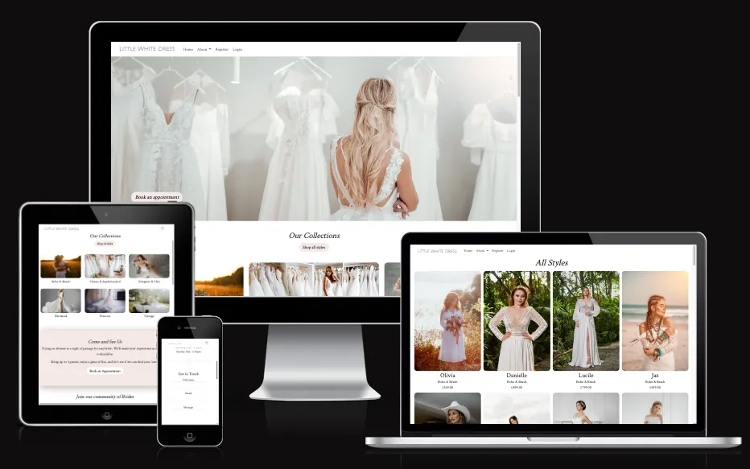
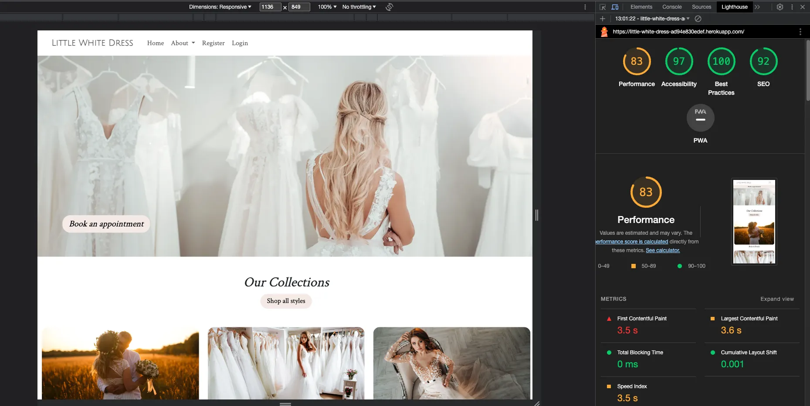
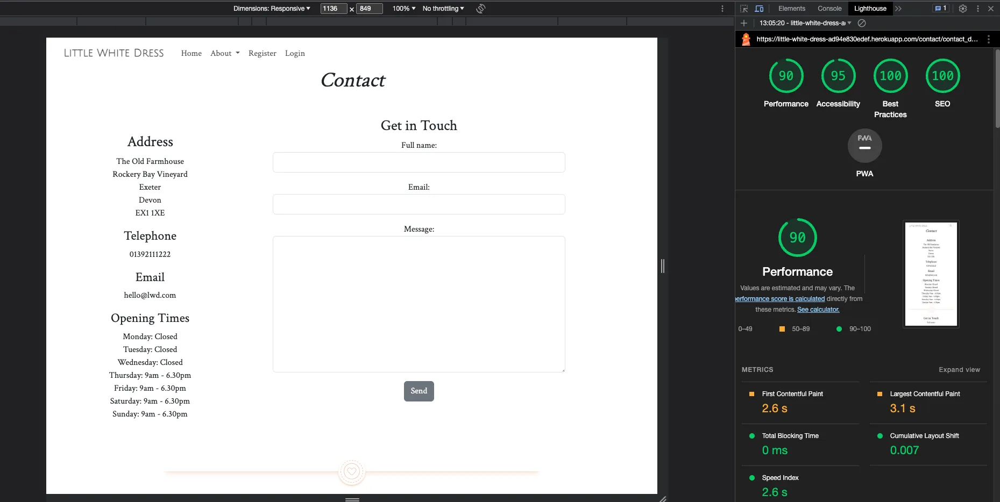
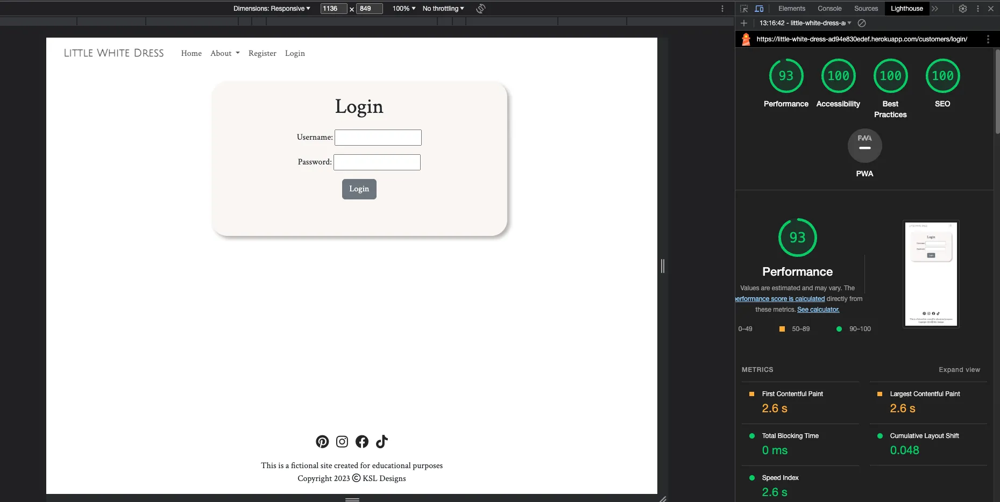
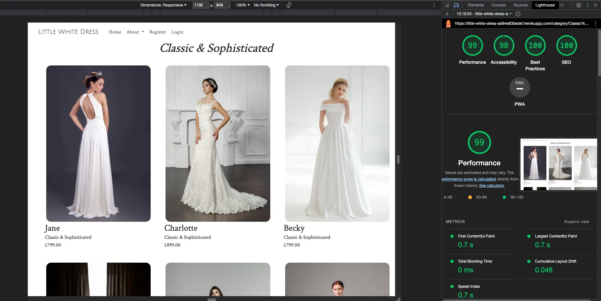
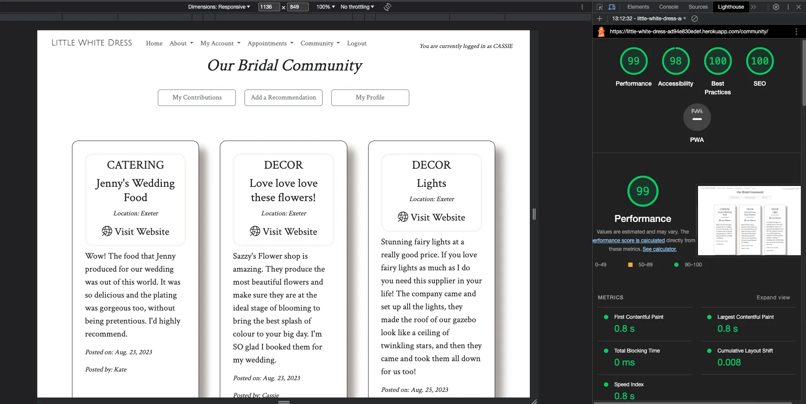

# Little White Dress

## Testing File

[Visit the  live website here](https://little-white-dress-ad94e830edef.herokuapp.com/)

 

## Contents

### [Testing](#testing-1)
- [Function Testing](#function-testing)
- [User Story Testing](#user-story-testing)
- [Lighthouse](#lighthouse)
- [Validator Testing](#validator-testing)
- [Bugs](#bugs)

 

----

 

## Testing
Testing was performed across a range of devices, including:
- MacBook Air M1
- Nothing Phone (1)
- iPhone 15 Plus

### **Function Testing**

| Page | Test | Successfully Completed |
| :----| :---| :----------------------:|
| All | Logo text links back to homepage | Yes |
| All | Navigation links go to relevant page | Yes |
| All | Navigation menu remains fixed at top of page on scroll | Yes |
| All | Social media icons in footer link to external sites, opening in new tabs | Yes |
| All | Call to action buttons link to relevant page | Yes |
| All | External links open to correct page and in a new tab | Yes |
| All | Images and text flex responsively | Yes |
| Contact | Form submits | Yes |
| Contact | Submitted form sends email | Yes |
| Register | Form creates new user | Yes |
| Login | Registered user can login successfully | Yes |
| Logout | Registered user can logout | Yes |
| Logout | Message is displayed on logout | Yes |
| Products/Profile | Favourited items are saved and appear on User's profile page | Yes |
| My Appointments | Booked appointments are visible to the User | Yes |
| Book Appointment | Form submits successfully | Yes |
| Book Appointment | Date that falls on a store closed day cannot be booked | Yes |
| Book Appointment | Date in the past cannot be booked | Yes |
| Book Appointment | A date and time that already exists in the database cannot be booked | Yes |
| My Appointments | Booked appointments can be rescheduled and cancelled | Yes |
| My Recommendations | Recommendations added by User are displayed | Yes |
| My Recommendations | Recommendations added by User can be amended and deleted | Yes |
| Add Recommendation | Form submits successfully | Yes |

 

### **User Story Testing**

| Client Goal | Solution | Tested & Successfully Completed |
| :----| :---| :----------------------:|
| As site admin I want to be able to upload and remove any dress products from the site | Using the Product model database this is possible via the admin portal | Yes |
| As a site admin I want to be able to view any enquiries sent via the website contact form | Enquiries sent via the contact form are accessible via the admin portal and are also emailed to the store's gmail address | Yes |
| As site admin I want to be able to view any bookings by customers to come and try on dresses | Using the Appointment model database this is accessed via the admin portal | Yes |
| As site admin I want to be able to amend any bookings by customers to come and try on dresses | Using the Appointment model database this is accessed via the admin portal | Yes |
| As site admin I want to be able to cancel any bookings by customers to come and try on dresses | Using the Appointment model database this is accessed via the admin portal | Yes |
| The website should create a strong brand identity | Through thought out use of colours, fonts and imagery | Yes |
| The website should be responsive across different devices | Using devtools and test users this was tested across a range of devices | Yes |

 

| First Time Visitor Goal | Solution | Tested & Successfully Completed |
| :----| :---| :----------------------:|
| As a first time user I want to browse available wedding dresses | Users can look at the dresses via the 'All Styles' button or by choosing a category | Yes |
| As a first time user I want to book an appointment to try on dresses | Various call to action buttons direct the User to register/login to book an appointment | Yes |
| As a first time user I want to save my favourite dresses so I can refer back to them later | Each product has a 'Favourite' button on their product details page. If a User is not registered they will be directed to register first | Yes |
| As a first time user I want to be able to contact the store | Address, phone and email are provided as well as a contact form | Yes |
| As a first time user I want to be able to filter my search by dress style and price | Due to time constraints this feature was not implemented but is planned for a future deploment | No |
| As a first time user I want to view details about the dress such as price and available sizes | The individual product detail page lists all necessary information | Yes |
| As a first time user I want to be able to find recommendations for other wedding services in the bridal community | A sample of recommendations are given on the homepage. If a User is not registered and wants to see more recommendations they are directed to first login | Yes |

 

| Returning Visitor Goal | Solution | Tested & Successfully Completed |
| :----| :---| :----------------------:|
| As a returning user I want to see my favourite dresses | When a User clicks on the Favourite button this is saved to their Profile until they remove it | Yes |
| As a returning user I want to view any current bookings I have to try on dresses | The 'My Appointments' page displays any current appointment bookings | Yes |
| As a returning user I want to amend any current bookings I have to try on dresses | Accessed via the 'My Appointments' page | Yes |
| As a returning user I want to cancel any current bookings I have to try on dresses | Accessed via the 'My Appointments' page | Yes |
| As a returning user I want to be able to post recommendations for other wedding services to the bridal community | Registered Users can do this via the Community section | Yes |

 

### **Lighthouse**

For Mobile Devices

Homepage

All Products

Category Products

Product Detail

About

Contact

Register

Login

Profile

Settings

Recommendations

Appointments

 

For Desktop

Homepage

All Products

Category Products

Product Detail

About

Contact

Register

Login

Profile

Settings

Recommendations

Appointments

 

### **Validator Testing**
HTML

Homepage

Dates Page

 

CSS

Stylesheet

   

### **Bugs**
  
  | Raised by | Bug | Solution |
  | :---      | :---| :---     |
  |  |  |  |
  |  |  |  |
  |  |  |  |
  |  |  |  |
  |  |  |  |
  |  |  |  |

 