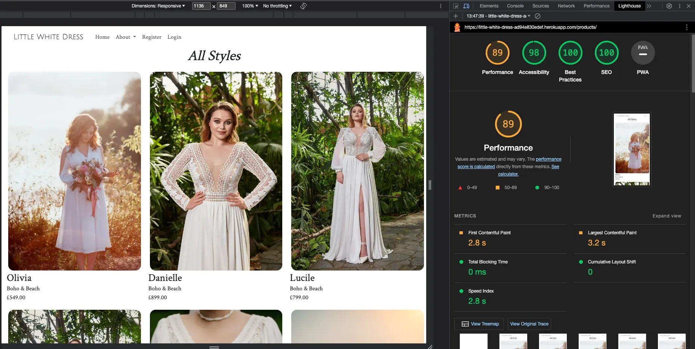
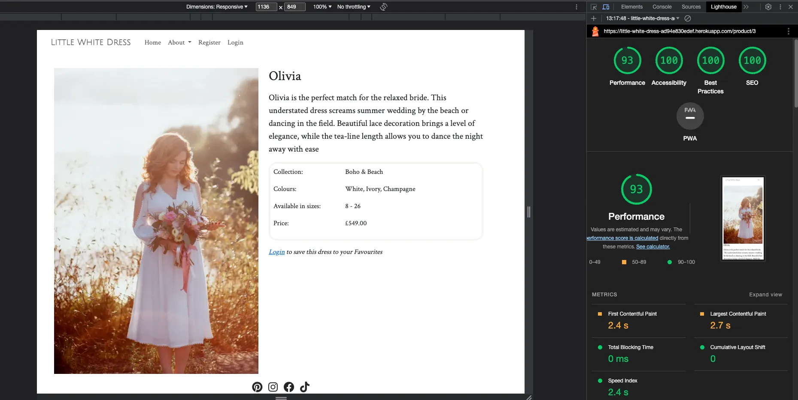
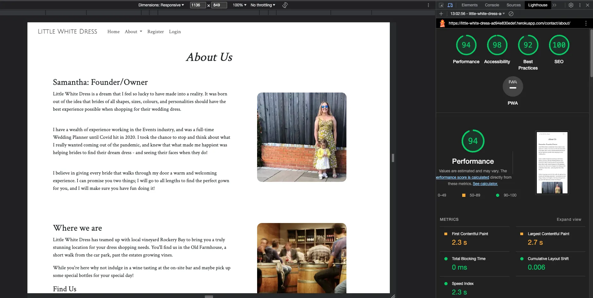
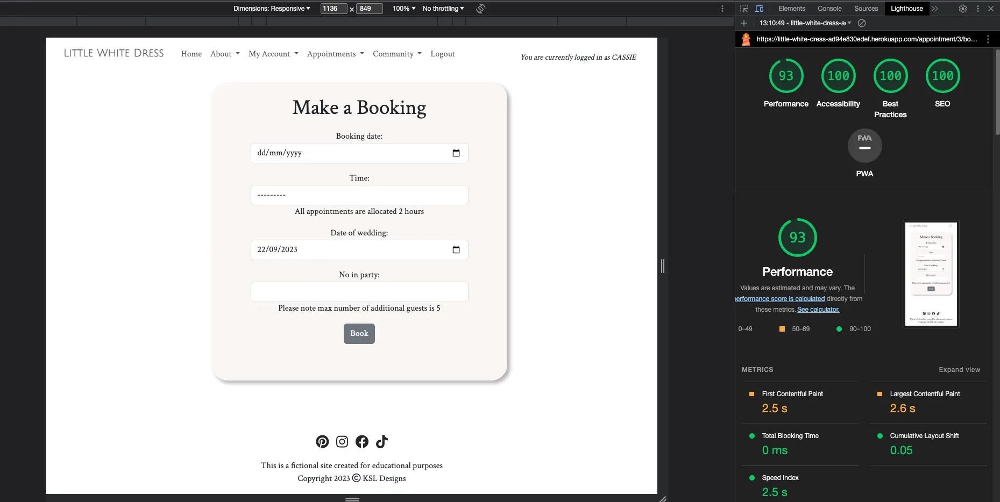
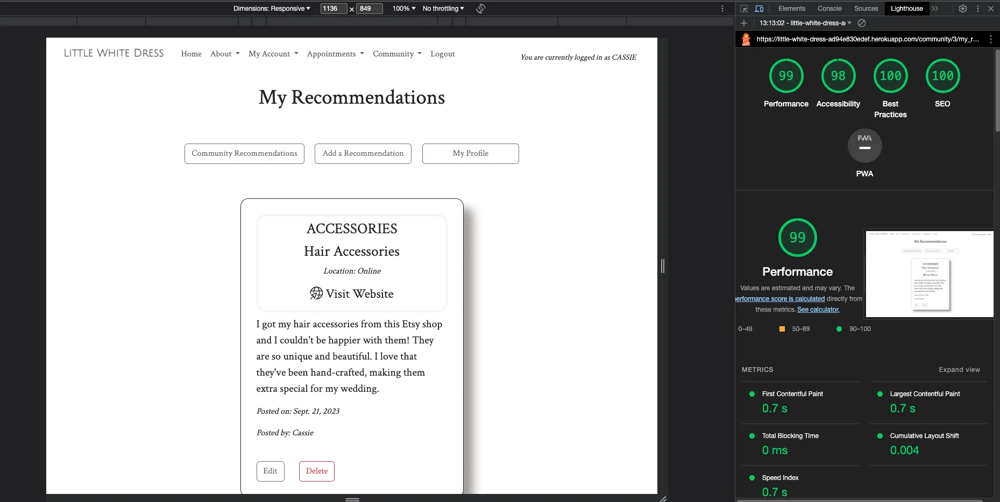
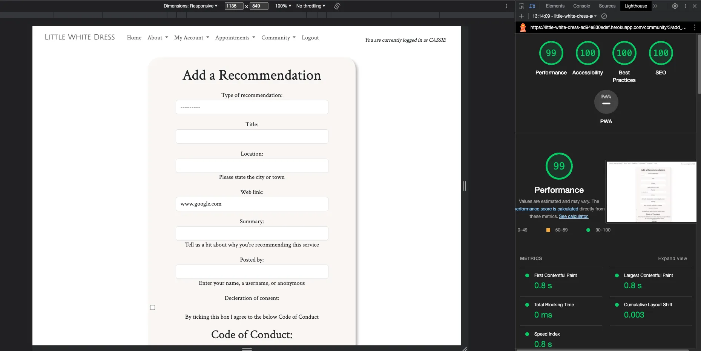

# Little White Dress

## Testing File

[Visit the  live website here](https://little-white-dress-ad94e830edef.herokuapp.com/)

 

## Contents

### [Testing](#testing-1)
- [Function Testing](#function-testing)
- [User Story Testing](#user-story-testing)
- [Lighthouse](#lighthouse)
- [Validator Testing](#validator-testing)
- [Bugs](#bugs)

 

----

 

## Testing
Testing was performed across a range of devices, including:
- MacBook Air M1
- Nothing Phone (1)
- iPhone 15 Plus

### **Function Testing**

| Page | Test | Successfully Completed |
| :----| :---| :----------------------:|
| All | Logo text links back to homepage | Yes |
| All | Navigation links go to relevant page | Yes |
| All | Navigation menu remains fixed at top of page on scroll | Yes |
| All | Social media icons in footer link to external sites, opening in new tabs | Yes |
| All | Call to action buttons link to relevant page | Yes |
| All | External links open to correct page and in a new tab | Yes |
| All | Images and text flex responsively | Yes |
| Contact | Form submits | Yes |
| Contact | Submitted form sends email | Yes |
| Register | Form creates new user | Yes |
| Login | Registered user can login successfully | Yes |
| Logout | Registered user can logout | Yes |
| Logout | Message is displayed on logout | Yes |
| Products/Profile | Favourited items are saved and appear on User's profile page | Yes |
| My Appointments | Booked appointments are visible to the User | Yes |
| Book Appointment | Form submits successfully | Yes |
| Book Appointment | Date that falls on a store closed day cannot be booked | Yes |
| Book Appointment | Date in the past cannot be booked | Yes |
| Book Appointment | A date and time that already exists in the database cannot be booked | Yes |
| My Appointments | Booked appointments can be rescheduled and cancelled | Yes |
| My Recommendations | Recommendations added by User are displayed | Yes |
| My Recommendations | Recommendations added by User can be amended and deleted | Yes |
| Add Recommendation | Form submits successfully | Yes |

 

### **User Story Testing**

| Client Goal | Solution | Tested & Successfully Completed |
| :----| :---| :----------------------:|
|   |  |  |
|   |  |  |
|   |  |  |
|   |  |  |
|   |  |  |

 

| First Time Visitor Goal | Solution | Tested & Successfully Completed |
| :----| :---| :----------------------:|
|   |  |  |
|   |  |  |
|   |  |  |
|   |  |  |

 

| Returning Visitor Goal | Solution | Tested & Successfully Completed |
| :----| :---| :----------------------:|
|  |  |  |
|  |  |  |
|  |  |  |

 

| Frequent Visitor Goal | Solution | Tested & Successfully Completed |
| :----| :---| :----------------------:|
|  |  |  |
|  |  |  |
|  |  |  |

 

### **Lighthouse**

For Mobile Devices

Homepage

All Products

Category Products

Product Detail

About

Contact

Register

Login

Profile

Settings

Recommendations

Appointments

 

For Desktop

Homepage

All Products

Category Products

Product Detail

About

Contact

Register

Login

Profile

Settings

Recommendations

Appointments

 

### **Validator Testing**
HTML

Homepage

Dates Page

 

CSS

Stylesheet

   

### **Bugs**
  
  | Raised by | Bug | Solution |
  | :---      | :---| :---     |
  |  |  |  |
  |  |  |  |
  |  |  |  |
  |  |  |  |
  |  |  |  |
  |  |  |  |

 